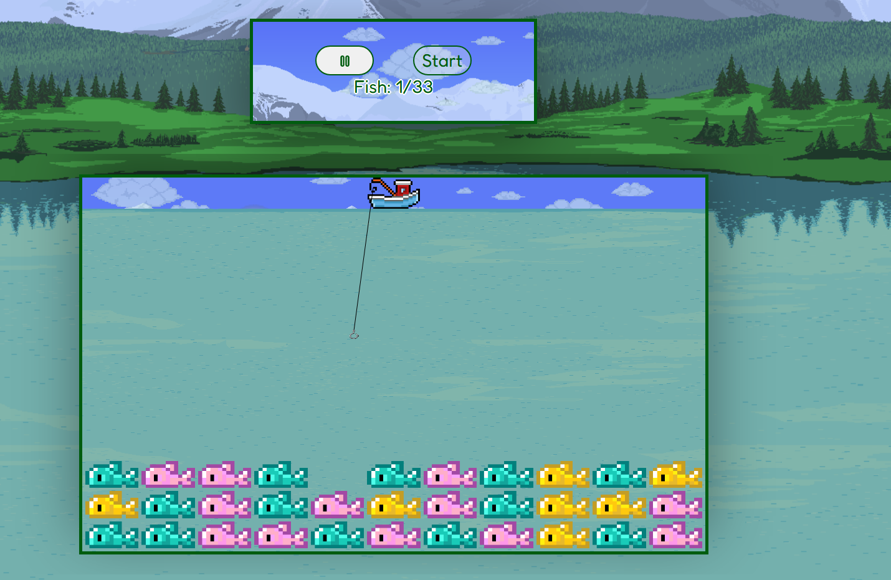
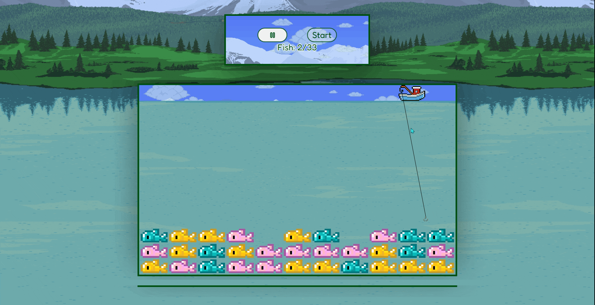

# 🎣 Lazy Lake

Welcome to **Lazy Lake** — a fun twist on the classic **brick-breaker** game, themed around **fishing on a peaceful lake**!  
Instead of smashing bricks, you're casting your hook to catch **all 33 fish** while navigating across a relaxing water scene.

---

## 🕹 Game Concept

- **Goal**: Catch **all the fish** swimming in the lake by bouncing your fishing hook (ball) off your boat (paddle).
- **Theme**: A relaxing fishing day on a calm lake.
- **Twist**: Instead of bricks, you’re catching **fish**.  
- **Challenge**: Don't let the hook get too far away — keep bouncing it off your boat!

---

## 🚀 How to Play

1. **Start** the game by pressing the **Start** button.
2. Move your boat left and right using **keyboard arrows** or **dragging with the mouse**.
3. Bounce the fishing hook to catch fish (destroy bricks).
4. Catch **all 33 fish** to win!
5. Lose if you miss the ball and it gets too far.
6. **Pause/Resume** the game with the **Pause button**.

---

## 🎨 Features

- Beautiful fishing and lake-themed graphics 🎣🏞
- Responsive paddle movement (mouse drag or arrow keys).
- **Pause/Resume** functionality with a custom image toggle.
- Score counter tracking how many fish you've caught.
- Fun twist on the traditional brick-breaker gameplay.

---

## 🛠 Technologies Used

- **HTML5 Canvas**
- **JavaScript (Vanilla + jQuery)**
- **CSS3**

---

## 📸 Screenshots

---

## 🙌 Credits

Designed and developed by - [@Mitja Filej](https://www.github.com/mit72).  
Fishing idea inspired by lazy afternoons at the lake. 🎣🌊

---

> **Lazy Lake** — Where patience meets play!

