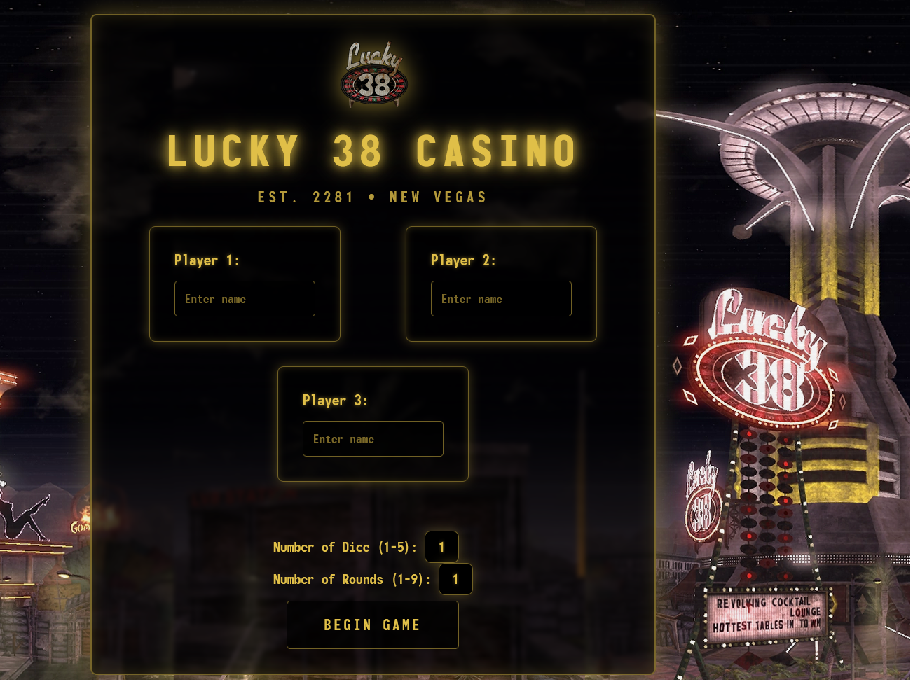
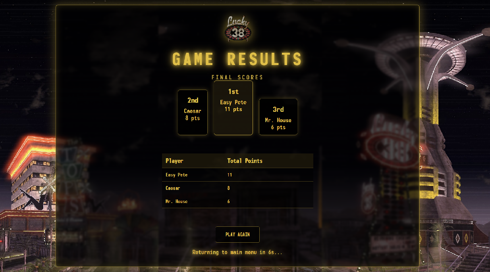

---

# 🎲 Lucky38 Casino Dice Game

Welcome to **Lucky38**, a Fallout-inspired retro-futuristic dice game built in PHP. This project lets 1–3 players roll dice over multiple rounds to determine the ultimate high roller. The visual style pays tribute to the iconic Lucky 38 casino from New Vegas.

---

## 🚀 How to Run

1. **Install XAMPP** local PHP server.
2. Place the entire `Lucky38` folder inside `htdocs`.
3. Start Apache via XAMPP.
4. Visit the game at:  
   [http://localhost/Lucky38/index.php](http://localhost/Lucky38/index.php)

---

## 🧩 Features

- Supports **1 to 3 players**
- Select **1–5 dice** and **1–9 rounds**
- Retro-futuristic theme with glowing inputs and styled buttons
- Animated roll results and final winner display
- Automatic **10s countdown redirect** after game ends

---

## 🛠 Tech Stack

- **PHP** – Game logic and session management
- **HTML/CSS** – Interface with neon-themed styles
- **JavaScript** – Countdown timer for auto-redirect
- **Animate.css** – Smooth entrance animations

---

## 🧪 Notes

- Form fields must be filled in for each player (or leave blank for fewer players)
- If the result section overflows, it becomes scrollable
- Countdown on `konec.php` returns to start automatically in 10 seconds

---

## 📸 Screenshot

---

## 🤝 Credits

- Designed and developed by - [@Mitja Filej](https://www.github.com/mit72).  
- Inspired by Fallout:New Vegas **Lucky 38 Casino**

---

